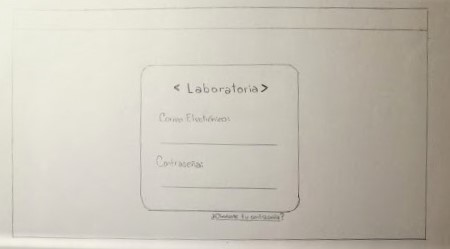
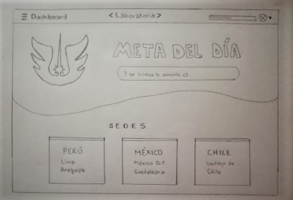
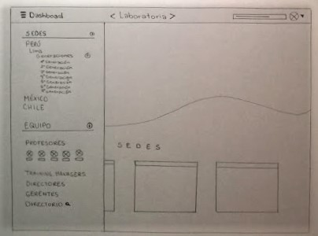
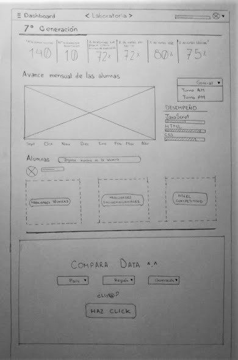
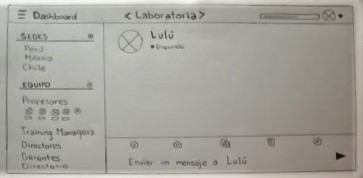
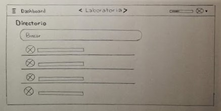
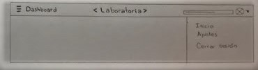
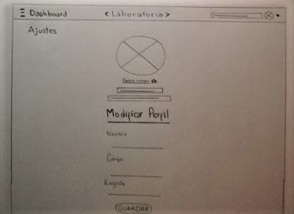

# Proyecto 3: Crear un sketch para la herramienta del dashboard de Laboratoria.

### Descripción del Proyecto:

El dashboard es una herramienta utilizada por profesores, training managers, directores y gerentes de Laboratoria para ver rápidamente qué está pasando en el salón de clases de Laboratoria. En el dashboard, los usuarios mencionados pueden ver rápidamente estadísticas y datos en tiempo real como:

* número de alumnas inscritas.
* número de alumnas que desertaron.
* número y % de alumnas que pasan el criterio mínimo de  evaluación.
* Promedio de notas por sprint.
* Promedio de notas HSE.
* Promedio de notas técnicas.

### Descripción de la realización del reto:

* La página de registro al dashboard de Laboratoria:

* La página de inico:

* Al hacer click en el ícono de la hamburguesa deberá aparecer una lista de las sedes y equipo de Laboratoria:

* Al hacer click en alguna de la generación de estudiantes relativo a su región aparecerá esta página con gráficos estadísticos y, poder luego realizar una comparación de la generación seleccionada con otra:

* Al hacer click en uno de los usuarios miembros del equipo deberá aparecer un chat:

* En caso de no haber encontrado a la persona con quien comunicarte en ese momento, se puede acceder al directorio y escribir su nombre:

* Al hacer click en el ícono de triangulo invertido al lado de la imagen del usuario en la derecha, aparecerá el siguiente listado de opciones:

* Si desea modificar algo de tu perfil en el dashboard, puedes acceder a <code>Ajustes</code>.

